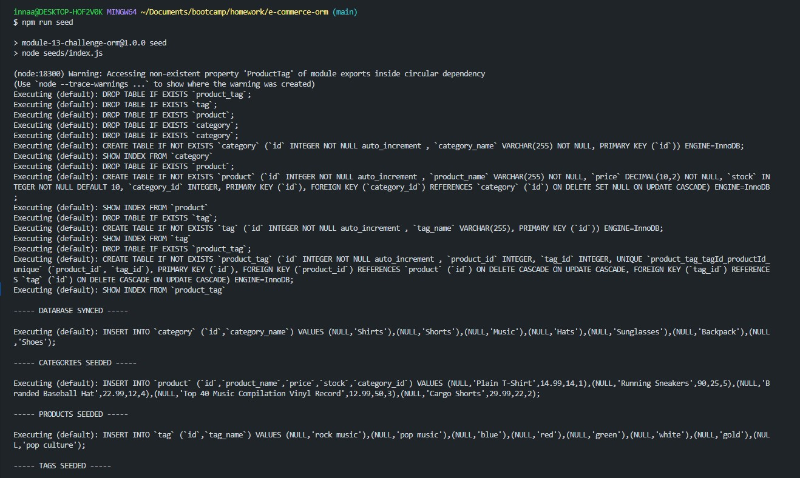
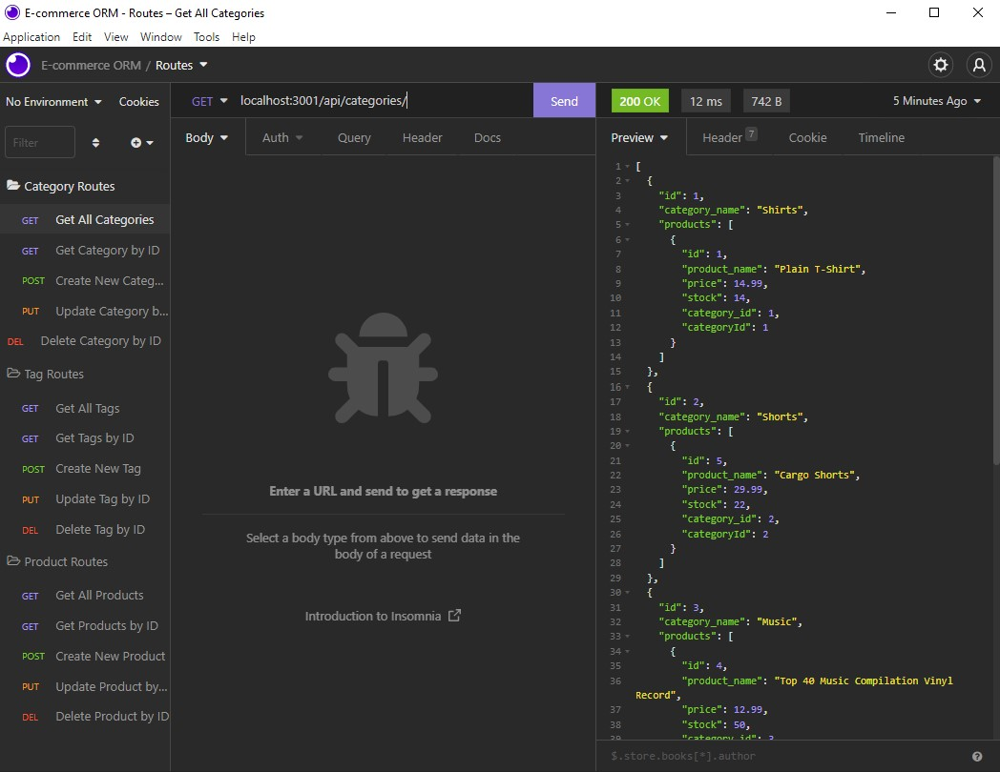

# E-Commerce-ORM

  

  ## Description
  E-commerce is the buying and selling of goods and services using the internet and the transfer of money to execute these transactions. Create a back end e-commerce site that utilizes Express.js API to use Sequalize and interact with MySQL database. Creating  

  ## Table of Contents
  1. [Installation](#installation)
  2. [Task](#task)
  3. [Usage](#usage)
  4. [Video](#video)
  5. [Screenshots](#screenshots)
  6. [License](#license)
  7. [Questions](#questions)

  ## Installation
  Please install the following dependencies in the terminal to run the application. 
  * [MySQL2](https://www.npmjs.com/package/mysql2)
  * [Sequelize](https://www.npmjs.com/package/sequelize)
  * [dotenv](https://www.npmjs.com/package/dotenv)
  * [express](https://www.npmjs.com/package/express)

  ## Task
  In order to use this application, the following requirements are met when:
  ```md
  GIVEN a functional Express.js API
  WHEN I add my database name, MySQL username, and MySQL password to an environment variable file
  THEN I am able to connect to a database using Sequelize
  WHEN I enter schema and seed commands
  THEN a development database is created and is seeded with test data
  WHEN I enter the command to invoke the application
  THEN my server is started and the Sequelize models are synced to the MySQL database
  WHEN I open API GET routes in Insomnia for categories, products, or tags
  THEN the data for each of these routes is displayed in a formatted JSON
  WHEN I test API POST, PUT, and DELETE routes in Insomnia
  THEN I am able to successfully create, update, and delete data in my database
  ```
  ## Usage
  Follow the steps below to begin the application:
  1. `mysql -u root -p`
  2. type in your mysql password
  3. `source db/schema.sql`
  4. `quit`
  5. `npm run seed`
  6. `npm start`

  ## Video

  [Click to deploy video](https://youtu.be/kWcLg4JHjhE)

  ## Screenshots
  
  

  ## License
  This project is covered under MIT.

  ## Questions
  For inquiries about the repo, you can find me through GitHub at [inna-arabejo](https://github.com/inna-arabejo). 
  For any additional questions, you can reach me through my email at [iarabejo3@gmail.com](mailto:iarabejo3@gmail.com).